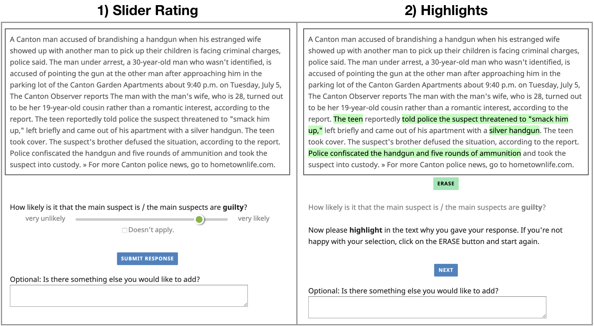
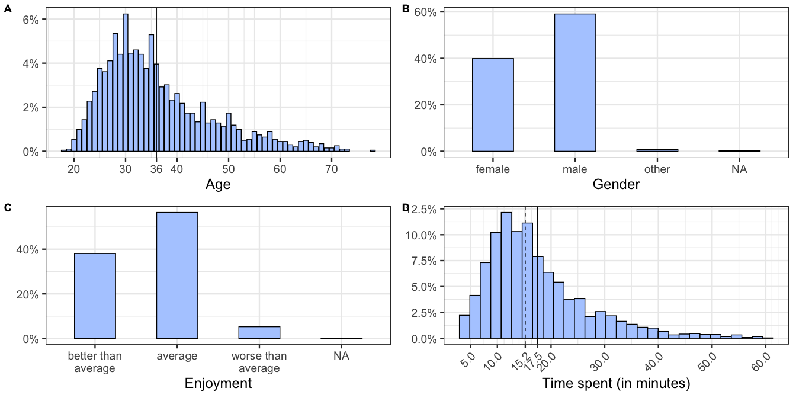
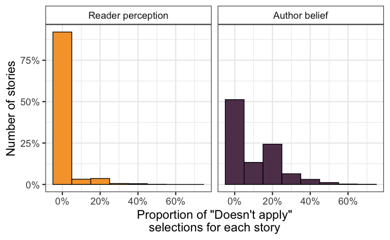
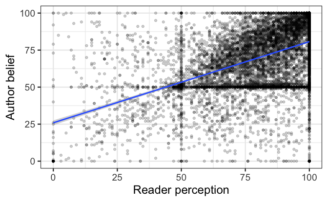
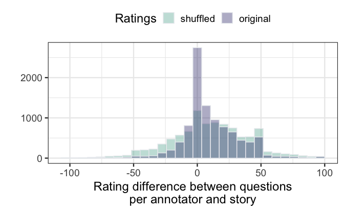

SuspectGuilt Corpus Analysis
================

[1. Experimental setup](#experimental-setup)

[2. Annotator pool and exclusions](#annotator-pool-and-exclusions)

[3. Data postprocessing and exclusions](#data-postprocessing-and-exclusions)

[4. Raw corpus data overview](#raw-corpus-data-overview)

[5. Annotation analysis](#annotation-analysis)

[6. Model: Token importance analysis](#model-token-importance-analysis)

Experimental setup
==================

Try out the experiment yourself [here](https://elisakreiss.github.io/modeling_guilt/experiments/02_main/03_highlighting/index.html)!

2818 annotators contributed to 3463 submissions on Amazon's Mechanical Turk. The approximated time for completion was 15 minutes and each participant was paid $2.50. We restricted participation to IP addresses within the US and an approval rate higher than 97%. Participants were asked to read 5 stories and respond to three questions about them:

1.  Reader perception about guilt: "How likely is it that the main suspect is / the main suspects are guilty?"
2.  Author belief about guilt: "How much does the author believe that the main suspect is / the main suspects are guilty?"
3.  Attention check question, such as "How likely is it that this story contains more than five words?"

Responses were collected on a continuous slider, underlyingly coded as ranging from 0 (very unlikely) to 1 (very likely). After submitting the slider response for each question, they were asked to "highlight in the text why \[they\] gave \[their\] response".



Annotator pool and exclusions
=============================

<!-- ## Exclusions -->
We excluded participants who indicated that they did the Hit incorrectly or were confused (544), who indicated that they had a native language other than English (71), who spent less than 3.5 minutes on the task (53) and who gave more than 2 out of 5 erroneous responses in the control questions (359). A response is considered erroneous when a clearly true or false question incorrectly received a slider value below or above 50 (the center of the scale) respectively. Additionally, we excluded 120 annotations because annotators had seen this story in a previous submission. Overall, we excluded 1035 submissions + 120 annotations (15405 annotations out of 51945, resulting in 36420 annotations).

1791 workers (89%) only participated once (i.e., they read 5 stories and submitted 15 annotations in total), making up 74% of all annotations. Only 3% of all annotations are submitted by workers who participated more than two times.

<!-- ## About the participants (after exclusion) -->
The average age of annotators was 36 (note the slightly artificial concentration at 30, 35, 45 and 50) with a slightly higher proportion of male over female participants. The median time annotators spent on the study was 15.2 minutes, which is in line with our original time estimates. Overall, annotators indicated that they enjoyed the study.



Data postprocessing and exclusions
==================================

"Doesn't apply" selections
--------------------------

In the study, annotators had the option to indicate that the question cannot be applied to the news story. Overall, participants rarely used that option, but more so for the question about the author's beliefs than the general guilt question. The amount of withheld responses is still fairly low at less than 11%.


If several annotators agree that a question cannot be answered in the context of one particular story, it might be an indication that this story is not suitable for the corpus. In the following graph, we show the different rates to which annotators selected "Doesn't apply" for each story. In the final corpus, we decided to exclude stories where this box was selected more than 30% of the time with that particular question. Further inspection showed that this mainly affected summary news articles which addressed multiple stories and suspects and therefore the questions could not be uniquely attributed to one specific case.



Exclusions
----------

We filter all datapoints where a participant selected more than 95% of the text. This happened more often for the *Author belief* question (403 exclusions out of 12128 datapoints) than in the *Reader perception* question (67 exclusions out of 12128 datapoints) but still distributed over 1883 stories. We also exclude all question-story pairs where more than 30% of participants indicated that the question doesn't apply (see figure above). This leaves us with 1874 stories overall (1756 for *Author belief* and 1869 for *Reader perception*).

Finally, postanalysis revealed that the same articles were published under different headlines in different newspapers. If they were identical, those stories were merged with their duplicates, otherwise we kept the story with the most annotations. 53 stories were excluded due to duplicates, leaving us with 1821 stories overall (Reader perception: 1816; Author belief: 1705).

The resulting data constitutes the **SuspectGuilt Corpus**.

Raw corpus data overview
========================

The corpus comprises 1821 stories from local US-American newspapers.

<!-- #### Story length distributions -->
Stories are between 59 and 309 words long (with 373 to 1822 characters; maximum character length is 1967 with 297 words). The average amount of words is 215 and the mean number of characters is 1300. From that we can estimate an average word length of 6 characters per word.


Annotation analysis
===================

Data points per story and question type
---------------------------------------

After exclusions, all stories have 4 or more annotations. These two graphs show the number of annotations per story for each question. This excludes cases where annotators indicated that the question doesn't apply.


Slider rating distributions for each question
---------------------------------------------

Both distributions (for Reader perception and Author belief) are skewed towards the middle and maximum portions of the slider scale. Relatively few participants chose ratings in the “very unlikely” range. While Reader perception ratings are rather skewed to the maximum portion of the scale, Author belief responses are concentrated around the center. This suggests a disconnect between what readers believe about the suspect’s guilt more generally and what readers believe about the author’s beliefs. The cluster around the center also suggests that participants feel uncertainty, especially in the Author belief case.


Correlation of questions for each story and annotator (intraannotator agreement per story)
------------------------------------------------------------------------------------------

The left graph shows the correlation between the responses for Reader perception and Author belief for each individual worker and story. While we see clusters around the center and upper end of the scale, there is also a clear correlation (r=0.49).

The graph on the right shows the actual distribution in slider rating difference between the two questions and the distribution if ratings were randomly shuffled. Since the maximum guilt rating was 100, the maximum difference between the two questions is 100 as well. At 0 we find the cases where an annotator gave the same rating to both questions for a particular story. Positive differences are cases where the Reader perception in guilt received a higher rating and vice versa. Overall, the ratings show high agreement between questions, visible by the fact that most differences are around 0. This agreement is higher than predicted by a baseline where all slider ratings were shuffled.



Slider rating distributions across annotators
---------------------------------------------

There generally do not seem to be differences in ratings dependent on gender or age of the participants and also not the time spent or self-reported enjoyment. Most variance show the *other* and *NA* categories but they also have the least amount of data.


Interannotator agreement for slider values
------------------------------------------

Overall, ratings for Reader perception in guilt were higher than for the author's belief in guilt, which is far bigger than the error bars on each of these questions. The mean squared error for each story is slightly higher for the author's belief in guilt (MSE = 0.0410) than the Reader perception in guilt (MSE = 0.0313), indicating that there was less agreement between annotators on the belief of the author. This suggests that this task is harder.

To determine whether the annotations are meaningful for their respective stories, we compare the MSE of the actual data to the MSE of their shuffled counterparts. According to a Welch Two Sample t-Test, the MSE of the actual data is significantly smaller than the one of the randomly sampled distribution. This is true for both question types, suggesting that there is a signal in the data that drove participants' judgments.


Amount of separate highlights
-----------------------------

Participants mainly highlighted one passage in a story and rarely set more than 8 separate highlights (full range: 1 to 45). The plot is collapsed to the most relevant range and it also counts multiple selections of the same characters. This pattern is consistent for both question types.


Length of highlights
--------------------

Participants primarily marked passages shorter than 200 characters (which translates to approximately 33 words in this dataset). The Author belief question highlights tended to be shorter than the ones about Reader perception. Overall, highlights had a length between 1 and 1750 characters (ca. 292 words). This possibly suggests that the highlights for Reader perception were more contentful (i.e., chunks of meaning that can't be expressed in a single word) than for Author belief, where phrase-level meaning appears to become less relevant.

Note that a highlight here is defined as a consecutive mark without a non-highlighted character in between. If a participant highlighted two passages that are directly connected, they will count as one highlighting.


Proportion of text highlighted
------------------------------

Overall, participants highlighted less than half of the text for each question. In a majority of cases 10-15% of the stories were marked.


Highlighting position bias
--------------------------

For the Reader perception question, annotators often identified the relevant information in the later half of the story. For the Author belief question, the highlights are more distributed over the length of the stories. Given that news articles often follow a similar structure (e.g., description of the event, possible arrest, possible consequences), the highlighting data suggests that annotators took their Reader perception rating to be more affected by the content. The more uniform distribution of highlights over the whole story in the Author belief question possibly suggests a weaker relation to contentful phrases and rather general considerations of phrasing and language use (as discussed with the varying [length of highlights](##length-of-highlights)).


Interannotator agreement for highlights
---------------------------------------

<!-- 0 marks the point of maximum uncertainty, because exactly half of the annotators highlighted this character. -0.5 and 0.5 are the points of maximum certainty because respectively either no or all annotators highlighted the character. Since annotators generally only highlight a small proportion of the test, the majority of the count is on the lower portion of the spectrum. The question type does not seem to matter. -->
We would like to estimate agreement levels for highlighting as well. Because our stories have varying numbers of annotations, we cannot calculate a Fleiss kappa value for this problem. However, we can compare the percentage of annotators who highlighted each character with a random baseline. The random baseline highlights were created by randomly shuffling the underlying highlight distribution for each annotation. Since only 17.8% of characters are highlighted, most of them are by chance only highlighted by less than half of the annotators (presented in light green). Although this pattern generally holds for the original highlighting data as well (presented in dark green), they crucially vary in their agreement distribution. Compared to the random baseline, characters are less likely to be only highlighted by less than half of the annotators. Instead those characters are either not highlighted by anyone or by a majority of the annotators, suggesting a more meaningful structure in the highlighting data.

According to a Welch Two Sample t-Test, the shuffled highlighting agreement is significantly different from the original highlights (p&lt;0.0001).


Intraannotator agreement on what is highlighted for each question
-----------------------------------------------------------------

Relatedly, the following graph shows how similar each annotator's highlights are foreach story dependent on the question. The similarity between highlights is computed on a by-character basis, where similarity is 1 - (the number of characters that are highlighted in only one question), divided by the total number of characters.

Overall, annotators select similar passages to answer both questions. This suggests that annotators appear to primarily consider very similar information relevant to respond to both questions. However, the overlap is not perfect, providing room to account for the variance we see in the slider ratings and the differences described in the [length of highlights](##length-of-highlights) and their [positions](##highlighting-position-bias).


Frequently highlighted words
----------------------------

### Overall

Below we see the most likely words to be highlighted independent of question and chosen slider value. Whether a word was highlighted does not give an indication on whether it contributed to an increase or decrease in the rating provided.

The most highlighted word is *police* which makes up 2.5% of all highlights. Overall, a high rate of these words can count as hedges, such as *said, allegedly, according, accused*, and *alleges*. Another big portion of the selections refer to the act itself as in *crime, stolen, assault, possession* and *robbery*. A last group we can identify is one of the "judicial" procedure such as *police, suspect, suspects, victim, charges, officers, investigation, identified*.


### Reader perception vs. Author belief

The earlier analysis suggests that while the two questions appear to be correlated, they also differ in their average rating and what is highlighted. In the following graph, we give the words with the largest differences between the two guilt questions. Words that appear more to the left show the largest difference between highlights. Conventionalized devices like the hedges we saw above, which signal lack of commitment in reporting, become more prominent in the Author belief condition. This supports [Kreiss et al.](https://github.com/elisakreiss/iteratednarration/blob/master/writing/2019_cogsci/cogsci_IN.pdf)’s earlier findings of the relevance of these words for Author belief and not Reader perception, and further suggests that readers appear to have a metalinguistic awareness.


### High vs. low rating

Here we compare the lowest and highest guilt ratings given. We chose all annotations with ratings below the middle 50 slider rating, which are 1528 data points. To have approximately the same amount of data points on the higher rating end, we chose annotations above 99 rating, which are 3462 data points.

Plotted are the proportion of highlights with stories that received high and low guilt slider ratings. The x-axis is ordered according to the difference between highlights such that words to the left show the biggest difference. Hedges and uncertainty expression such as *alleged, allegedly* and *accused* are highlighted more often when participants gave lower guilt ratings. Higher ratings rather correspond with nouns and verbs directly associated with the crime such as *possession, stolen, vehicle, charged, officers, car* and *surveillance*.


### Rating & question interaction

When participants were asked about the author's belief, hedge words such as *alleged, allegedly* and *accused* show the biggest difference in highlights dependent on the rating. Hedges were marked more often when a low rating was given. (But note that hedges do not in general occur more often in the stories rated lower.)

Firstly we see that hedges and uncertainty expression such as *alleged, allegedly* and *accused* are highlighted more often when participants gave lower guilt ratings. Higher ratings rather correspond with nouns and verbs directly associated with the crime such as *assault, stolen, vehicle, charged, officers* and *video*.

Now we compare the interactions between questions and high/low ratings. When the rating is high, *allegedly* is highlighted at a very similar rate for both questions (position 25). However when the rating is low, *allegedly* becomes the word with the biggest difference between the two questions. It is considered more relevant in the context of the author's belief in guilt than the Reader perception in guilt. This is in line with the qualitative results from the CogSci 2019 paper.


Correlation of overall word frequency and highlighted frequency
---------------------------------------------------------------

Above we have done the simplest form of highlighting analysis: removed the stopwords and extract the 30 most highlighted words. However the amount of times a word is highlighted, highly correlates with the number of occurrences (r=0.968) which suggests that some words are simply highlighted more often because they occur more often. While this correlation is an important confound, it can't explain away the differences we find in highlights between the two questions and low vs. high ratings.


For a qualitative analysis, we can unfold word frequency on the x axis. By chance, words would be highlighted 14.88% of the time, indicated by the dashed grey line. Words that are highlighted more often than predicted by chance are above this line, suggesting that they take on an important role in annotators' judgments. Words that are highlighted less than expected by chance are not considered relevant for assessment and words that are at chance might cooccur with more and less relevant information.

If words occur very rarely we cannot determine their context-invariant importance which is why we exclude words that occur less than 25 times.

We can see that the [30 most highlighted words](##frequently-highlighted-words) (here in red) are also among the most frequently occuring words, as suggested by the high correlation between frequency and number of highlights above. The overall patterns seem reassuring. While the words above chance can generally be associated with criminal investigations, words at the bottom are less so. While words on the top for instance refer to evidence, such as *eyewitnesses, camera, footage*, and *surveillance*, the words on the bottom rather reference general words that come with metainformation of the article, such as *google, newsletter, shutterstock*, and *map*.


Effect of hedges on slider ratings and highlights
-------------------------------------------------

The number of hedges tends to increase with the length of the stories.


While it seems a reasonable hypothesis that the guilt assessment changes dependent on the number of hedges, the left graph shows that there is no correlation between the absolute number of hedges in the original stories and slider ratings.

However, when we look at which words were highlighted, we can see that uncertainty expressions are more likely to be highlighted with lower slider rating, but only in the Author belief question. This means that even though those uncertainty expressions do not occur more often in lower rated questions, they are highlighted more often as a justification of lower ratings. However this is only the case when the question is about the author's beliefs and not the "objective" guilt question, indicating that these expressions do not hedge on the actual event but rather on the reader's perception of the author's opinion. This replicates earlier findings in [Kreiss et al. (2019)](https://github.com/elisakreiss/iteratednarration/blob/master/writing/2019_cogsci/cogsci_IN.pdf).


Model token importance analysis
===============================

Finally, we can inspect which tokens the model considers relevant and relate those to the words annotators highlighted. In the graph below, we see the average importance for each token as assigned by the model. The values are obtained from the test-set runs averaged across 20 genre-pretrained models with different random train–test splits. In contrast to the highlighting data, the token importance measure differentiates between tokens that increase (&gt; 0) and decrease the predicted rating (&lt; 0). The 30 words which were most highlighted by the annotators are presented in red. Note that those words are not as predictable by token frequency here since the empirical highlighting data is over the whole dataset and the model's token importance is only computed over a subset of this data.

While it seems intuitive that *confessed* increases the predicted rating and *alleging* reduces it, it seems rather unintuitive that *innocent* should increase the rating and *suspicion* reduce it.


Model token importance vs. annotators highlights
------------------------------------------------

We now compare the token importance assigned by our model for words that were highlighted more than expected at random (purple) and words that were highlighted less than expected at random (green). The model without pretraining puts on average the same importance on words that people seem to consider crucial and not crucial for their assessment. However, the model with pretraining considers words that people highlight more as more important than words that were highlighted less (Welch Two Sample t-test: p &lt; 0.01). This suggests that pretraining already helps the model to learn some differentiation that people appear to consider when making their judgment.


Beyond this, however, there is little correlation between the absolute attribution score for each word and its highlighting proportion (r = 0.07 for the model with pretraining and r = 0.02 for the model without pretraining). Given the strong frequency artifacts in the empirical highlighting data, this correlation is computed using the proportion of highlights, i.e., how often a word was highlighted given the total number of occurrences.


<!-- # Left over -->
<!-- ```{r model token importance nonpretrained, echo=FALSE, message=FALSE, warning=FALSE, paged.print=FALSE} -->
<!-- library(tm) -->
<!-- punct_chars = c(".", ",", "!", ":", "/", "|", "'", '"', "\\", "_", "-") -->
<!-- df_mti_nopre = read_csv(here("data","model_tokenimportance","uncased0.csv")) %>% -->
<!--   rbind(read_csv(here("data","model_tokenimportance","uncased1.csv"))) %>% -->
<!--   mutate_at(vars(trial_type), funs(ifelse(.==0, "author_belief", "general_belief"))) %>%  -->
<!--   group_by(token) %>% -->
<!--   mutate(frq = n()) %>%  -->
<!--   mutate(log_frq = log(frq)) %>%  -->
<!--   ungroup() %>%  -->
<!--   mutate(stopword = token %in% stopwords("english")) %>%  -->
<!--   mutate(token_score_abs = abs(token_score)) %>%  -->
<!--   mutate(punctuation = token %in% punct_chars) %>%  -->
<!--   mutate(spec_char = ifelse(punctuation | stopword, T, F)) -->
<!-- mti_meanabs_nopre = df_mti_nopre %>%  -->
<!--   group_by(token, log_frq, spec_char, trial_type) %>%  -->
<!--   # summarize(mean_ts = mean(token_score_abs)) %>% -->
<!--   summarize(mean_ts = mean(token_score)) %>% -->
<!--   ungroup() -->
<!-- nostopw_nopre = mti_meanabs_nopre %>% -->
<!--   filter(!spec_char) -->
<!-- # 1) This one -->
<!-- nostopw_nopre %>%  -->
<!--   mutate(mean_logfrq = mean(log_frq)) %>% -->
<!--   # filter(log_frq > mean_logfrq) %>% -->
<!--   filter(log_frq > 4.5) %>% -->
<!--   # filter(log_frq > 6) %>% -->
<!--   ggplot(., aes(x=log_frq, y=mean_ts, label=token)) + -->
<!--     # facet_wrap(~trial_type) + -->
<!--     geom_point(alpha=0.2) + -->
<!--     # geom_text( -->
<!--     #           # data=filter(nostopw, str_detect(token, best_model_words) & -->
<!--     #           #               !str_detect(token, "#") & log_frq > 4.5), -->
<!--     #           # aes(x=log_frq, y=mean_ts, label=token), -->
<!--     #           aes(label=token), -->
<!--     #           color="lightgrey", -->
<!--     #           hjust=0,  -->
<!--     #           vjust=0) + -->
<!--     geom_text( -->
<!--               data=filter(nostopw, str_detect(token, best_model_words) & -->
<!--                             !str_detect(token, "#") & log_frq > 4.5), -->
<!--               aes(x=log_frq, y=mean_ts, label=token), -->
<!--               hjust=0,  -->
<!--               vjust=0) + -->
<!--     scale_color_manual(values = c("#a6a6a6", "#ff7f7f")) + -->
<!--     theme(legend.position = "none") + -->
<!--     xlab("Token frequency (log)") + -->
<!--     ylab("Mean token importance") + -->
<!--     xlim(c(4.5,10.7)) -->
<!--     # geom_text(aes(label=token),hjust=0, vjust=0) -->
<!-- nostopw_nopre %>%  -->
<!--   mutate(mean_logfrq = mean(log_frq)) %>%  -->
<!--   filter(log_frq > mean_logfrq) %>%  -->
<!--   ggplot(., aes(x=log_frq, y=mean_ts, label=token)) + -->
<!--     facet_wrap(~trial_type) + -->
<!--     geom_point() + -->
<!--     geom_text(aes(label=token),hjust=0, vjust=0) -->
<!-- ``` -->
<!-- ```{r sdlkfjlsdk, echo=FALSE, message=FALSE, warning=FALSE, paged.print=FALSE} -->
<!-- model_comparison = mti_meanabs %>%  -->
<!--   rename(ts_pre = "mean_ts") %>%  -->
<!--   left_join(mti_meanabs_nopre) %>%  -->
<!--   rename(ts_nopre = "mean_ts") -->
<!-- ggplot(model_comparison, aes(x=ts_nopre, y=ts_pre, color=log_frq, label=token)) + -->
<!--   facet_wrap(~trial_type) + -->
<!--   geom_point() + -->
<!--   geom_text(aes(label=token),hjust=0, vjust=0) + -->
<!--   geom_abline(slope=1) + -->
<!--   geom_hline(yintercept=0) + -->
<!--   geom_vline(xintercept=0) -->
<!-- model_comparison %>%  -->
<!--   mutate(ts_diff = ts_pre - ts_nopre) %>%  -->
<!--   ggplot(., aes(x=log_frq, y=ts_diff, label=token)) + -->
<!--     facet_wrap(~trial_type) + -->
<!--     geom_point() + -->
<!--     geom_text(aes(label=token),hjust=0, vjust=0) -->
<!-- ``` -->
<!-- ```{r eval=FALSE, include=FALSE} -->
<!-- summary_highl %>%  -->
<!--   arrange(-prop) %>%  -->
<!--   # filter(total_count > 50) %>%  -->
<!--   head(n=30) %>%  -->
<!--   ggplot(., aes(x=reorder(value, -prop), y=prop)) + -->
<!--       geom_bar(stat="identity", -->
<!--                fill=col_unified) + -->
<!--       theme(axis.text.x = element_text(angle = 30, hjust=1)) + -->
<!--       ylab("Proportion of highlights") + -->
<!--       xlab("Most highlighted words (overall)") -->
<!-- best_words_df = summary_highl %>%  -->
<!--   group_by(value) %>%  -->
<!--   summarize(highl_count = sum(highl_count)) %>%  -->
<!--   ungroup() %>%  -->
<!--   arrange(-highl_count) %>%  -->
<!--   head(n=30) -->
<!-- best_words = str_c("\\b(", str_c(best_words_df$value, collapse = "|"), ")\\b") -->
<!-- summary_highl %>%  -->
<!--   # group_by(value) %>%  -->
<!--   # summarize(highl_count = sum(highl_count)) %>%  -->
<!--   # ungroup() %>%  -->
<!--   filter(highl_count > 30) %>%  -->
<!--   arrange(-prop) %>%  -->
<!--   head(n=30) %>%  -->
<!--   ggplot(., aes(x=reorder(value, -prop), y=prop)) + -->
<!--       geom_bar(stat="identity", -->
<!--                fill=col_unified) + -->
<!--       theme(axis.text.x = element_text(angle = 30, hjust=1)) + -->
<!--       ylab("Proportion of highlights") + -->
<!--       xlab("Most highlighted words (overall)") -->
<!-- # extract_mostcommon(all_highlighted_words) %>%  -->
<!-- #     head(n=30) %>%  -->
<!-- #     ggplot(., aes(x=reorder(value, -proportion), y=proportion)) + -->
<!-- #       geom_bar(stat="identity", -->
<!-- #                fill=col_unified) + -->
<!-- #       theme(axis.text.x = element_text(angle = 30, hjust=1)) + -->
<!-- #       scale_y_continuous(labels = scales::percent_format()) + -->
<!-- #       ylab("Proportion of highlights") + -->
<!-- #       xlab("Most highlighted words (overall)") -->
<!-- authorbelief_highl_words = paste(df_highlighted[df_highlighted$trial_type=="Author belief",]$selected_words, collapse = "") -->
<!-- committedCrime_highl_words = paste(df_highlighted[df_highlighted$trial_type=="Reader perception",]$selected_words, collapse = "") -->
<!-- all_questions = extract_mostcommon(authorbelief_highl_words) %>%  -->
<!--   rename(authorbelief_count = count) %>%  -->
<!--   select(-proportion) %>%  -->
<!--   left_join(extract_mostcommon(committedCrime_highl_words)) %>%  -->
<!--   rename(committedCrime_count = count) %>%  -->
<!--   select(-proportion) -->
<!-- summary_highl = all_words %>%  -->
<!--   left_join(all_questions) %>%  -->
<!--   gather(trial_type, highl_count, authorbelief_count, committedCrime_count) %>%  -->
<!--   mutate(prop = highl_count/total_count) %>%  -->
<!--   mutate(hedge = str_detect(value, hedges_lexicon)) -->
<!-- summary_highl %>%  -->
<!--   # filter(total_count > 100) %>%  -->
<!-- ggplot(., aes(x=log_frq,y=prop, label=value)) + -->
<!--   geom_point() + -->
<!--   geom_text(aes(label=value),hjust=0, vjust=0) -->
<!--   # xlim(c(0,1000)) -->
<!-- cor(summary_highl$highl_count, summary_highl$total_count, use="complete.obs") -->
<!-- # plot 1 and 3 -->
<!-- summary_highl %>%  -->
<!--   # filter(hedge) %>%  -->
<!--   # mutate(log_frq = log(total_count)) %>%  -->
<!--   filter(total_count > 20) %>%  -->
<!--   ggplot(., aes(x=log_frq, y=prop, label=value)) + -->
<!--   # ggplot(., aes(x=total_count, y=highl_count, label=value)) + -->
<!--     # facet_wrap(~trial_type) + -->
<!--     geom_point() + -->
<!--     geom_text(aes(label=value),hjust=0, vjust=0) -->
<!-- cor(summary_highl$log_frq, summary_highl$prop, use="complete.obs") -->
<!-- library(data.table) -->
<!-- nopunct = df_viz %>%  -->
<!--   # head(n=3) %>%  -->
<!--   mutate(story_nopunct = str_replace_all(story_clean, "[[:punct:]]", "")) -->
<!-- s <- paste(nopunct$story_nopunct, collapse = ' ') -->
<!-- # ss <- data.frame(x=unlist(str_split(s, " "))) -->
<!-- ss <- data.frame(x=strsplit(s, "[[:space:]]+")[[1]]) -->
<!-- wordcount <- setDT(ss)[, .(freq = .N), x] -->
<!-- view(wordcount) -->
<!-- highl_freqprop = extract_mostcommon(all_highlighted_words) %>%  -->
<!--   left_join(wordcount, by=c("value"="x")) -->
<!-- highl_freqprop %>%  -->
<!--   ggplot(., aes(x=freq, y=count, label=value)) + -->
<!--     geom_point() + -->
<!--     geom_smooth(method="lm") + -->
<!--     geom_text(aes(label=value),hjust=0, vjust=0) + -->
<!--     xlim(c(0,15000)) + -->
<!--     ylim(c(0,4000)) -->
<!-- highl_freqprop %>%  -->
<!--   mutate(cfprop = count/freq) %>%  -->
<!--   arrange(-count) %>%  -->
<!--   head(n=500) %>%  -->
<!--   arrange(-cfprop) %>%  -->
<!--   head(n=30) %>%  -->
<!--   ggplot(., aes(x=reorder(value, -cfprop), y=cfprop)) + -->
<!--     geom_bar(stat="identity") + -->
<!--     theme(axis.text.x = element_text(angle=45, hjust=1)) -->
<!-- fullfreq = highl_freqprop %>%  -->
<!--   mutate(cfprop = count/freq) %>%  -->
<!--   arrange(-cfprop) %>%  -->
<!--   head(n=300) %>%  -->
<!--   mutate(full_freq = str_count(s, value)) -->
<!-- view(fullfreq) -->
<!-- # between questions -->
<!-- authorbelief_highl_words = paste(df_highlighted[df_highlighted$trial_type=="Author belief",]$selected_words, collapse = "") -->
<!-- committedCrime_highl_words = paste(df_highlighted[df_highlighted$trial_type=="Reader perception",]$selected_words, collapse = "") -->
<!-- all_questions = extract_mostcommon(authorbelief_highl_words) %>%  -->
<!--   rename(authorbelief_count = count) %>%  -->
<!--   select(-proportion) %>%  -->
<!--   left_join(extract_mostcommon(committedCrime_highl_words)) %>%  -->
<!--   rename(committedCrime_count = count) %>%  -->
<!--   select(-proportion) -->
<!-- all_questions %>%  -->
<!--   ggplot(., aes(x=authorbelief_count, y=committedCrime_count, label=value)) + -->
<!--   geom_point() + -->
<!--   geom_abline(slope=1) + -->
<!--   geom_text(aes(label=value),hjust=0, vjust=0) + -->
<!--   xlim(0,6000) + -->
<!--   ylim(0,6000) -->
<!-- # most Author belief -->
<!-- all_questions %>%  -->
<!--   mutate(diff = authorbelief_count - committedCrime_count) %>%  -->
<!--   arrange(-diff) %>%  -->
<!--   head(n=30) %>%  -->
<!--   ggplot(., aes(x=reorder(value,-diff), y=diff)) + -->
<!--     geom_point() + -->
<!--     theme(axis.text.x = element_text(angle=45, hjust=1)) -->
<!-- # most Reader perception -->
<!-- all_questions %>%  -->
<!--   mutate(diff = authorbelief_count - committedCrime_count) %>%  -->
<!--   arrange(diff) %>%  -->
<!--   head(n=30) %>%  -->
<!--   ggplot(., aes(x=reorder(value,diff), y=diff)) + -->
<!--     geom_point() + -->
<!--     theme(axis.text.x = element_text(angle=45, hjust=1)) -->
<!-- ``` -->
<!-- ### Corpus for qualitative analyses -->
<!-- 200 datapoints, 171 unique stories -->
<!-- ```{r qual corpus, eval=FALSE, include=FALSE} -->
<!-- df_qualstories = df_hedges %>%  -->
<!--   group_by(trial_type, story_id, story_clean, hedges_totalcount) %>%  -->
<!--   summarize(mean_slider_val = mean(slider_val), -->
<!--             annotations = n()) %>%  -->
<!--   ungroup() %>%  -->
<!--   filter(annotations > 3, -->
<!--          hedges_totalcount >= 3) %>%  -->
<!--   group_by(trial_type) %>%  -->
<!--   arrange(mean_slider_val) %>%  -->
<!--   mutate(min_counter = seq(1, n())) %>%  -->
<!--   arrange(-mean_slider_val) %>%  -->
<!--   mutate(max_counter = seq(1, n())) %>%  -->
<!--   ungroup() %>%  -->
<!--   filter(min_counter <= 50 | max_counter <= 50) %>%  -->
<!--   mutate(rating = case_when( -->
<!--     min_counter <= 50 ~ "low", -->
<!--     TRUE ~ "high" -->
<!--   )) -->
<!-- df_qualstories %>%  -->
<!--   mutate(rating = ifelse(min_counter <= 50, "lower", "upper")) %>%  -->
<!--   ggplot(., aes(x=hedges_totalcount, y=mean_slider_val)) + -->
<!--     facet_wrap(~trial_type) + -->
<!--     geom_point() + -->
<!--     geom_smooth(method="lm") -->
<!-- df_chosen = df_qualstories %>%  -->
<!--   mutate(chosen = TRUE) %>%  -->
<!--   select(trial_type, story_id, chosen) -->
<!-- df_hedges %>% -->
<!--   left_join(df_chosen) %>% -->
<!--   ggplot(., aes(x=hedges_highlcount, y=slider_val, color=chosen)) + -->
<!--     facet_wrap(~trial_type) + -->
<!--     geom_point() + -->
<!--     geom_smooth(method="lm") + -->
<!--     theme(legend.position = "top") + -->
<!--     xlab("Number of highlighted hedges") + -->
<!--     ylab("Slider rating") -->
<!-- ### -->
<!-- df_filtered = df_qualstories %>% -->
<!--   select(story_id, story_clean, hedges_totalcount, mean_slider_val, trial_type) %>%  -->
<!--   mutate(story_markedhedge_orig = str_replace_all(story_clean, hedges_lexicon, "***\\1**")) %>%  -->
<!--   select(-story_clean) %>%  -->
<!--   arrange(story_id) %>%  -->
<!--   mutate(counter = seq(1:n())) %>%  -->
<!--   mutate(editor = case_when( -->
<!--     counter <= (n()/3)+1 ~ "Chris", -->
<!--     counter >= (2*n())/3 ~ "Elisa", -->
<!--     TRUE ~ "Zijian" -->
<!--   )) %>%  -->
<!--   mutate(story_markedhedge_edited = story_markedhedge_orig) -->
<!-- view(df_filtered)   -->
<!-- df_filtered = df_hedges %>%  -->
<!--   group_by(trial_type, story_id, story_clean, hedges_totalcount) %>%  -->
<!--   summarize(mean_slider_val = mean(slider_val), -->
<!--             annotations = n()) %>%  -->
<!--   ungroup() %>%  -->
<!--   filter(annotations > 3, -->
<!--          hedges_totalcount > 3) %>%  -->
<!--   group_by(story_id) %>%  -->
<!--   mutate(both_trials = n()) %>%  -->
<!--   ungroup() %>%  -->
<!--   filter(both_trials == 2, -->
<!--          trial_type == "Reader perception") %>%  -->
<!--   view -->
<!-- df_blub = df_filtered[sample(nrow(df_filtered), 200), ] -->
<!-- chosen_ids = as.list(df_blub['story_id'])$story_id -->
<!-- df_chosen = df_hedges %>%  -->
<!--   filter(story_id %in% chosen_ids) %>%  -->
<!--   view -->
<!-- df_chosen %>%  -->
<!--   ggplot(., aes(x=reorder(story_id, slider_val), y=slider_val, color=trial_type)) + -->
<!--     geom_point(alpha=0.1) + -->
<!--     stat_summary(fun.y = "mean",  -->
<!--                  geom = "point", -->
<!--                  size = 4) -->
<!-- # df_chosen %>%  -->
<!-- #   select(story_id, story_clean, hedges_totalcount) %>%  -->
<!-- #   distinct() %>%  -->
<!-- #   mutate(story_markedhedge_orig = str_replace_all(story_clean, regex(hedges_lexicon, ignore_case = TRUE), "***\\1**")) %>%  -->
<!-- #   mutate(story_markedhedge_edited = story_markedhedge_orig) %>%  -->
<!-- #   mutate(story_markedhedge_removed = story_markedhedge_orig) %>%  -->
<!-- #   write_csv(., here("filtered_hedges.csv")) -->
<!-- df_viz %>% -->
<!--   # select(story_id, story, story_clean, headline, slider_val, annotation_id, story_whighl_cleaned, highlighted) %>% -->
<!--   write_csv(., here("main_ratings.csv")) -->
<!-- df_viz %>%  -->
<!--   select(story_id, story_clean, headline) %>% -->
<!--   distinct() %>%  -->
<!--   write_csv(., here("lookup.csv")) -->
<!-- ``` -->
<!-- ```{r eval=FALSE, include=FALSE} -->
<!-- df_viz %>%  -->
<!--   select(story_id, story_clean) %>%  -->
<!--   distinct() %>%  -->
<!--   arrange(story_clean) %>%  -->
<!--   view() -->
<!-- ``` -->
